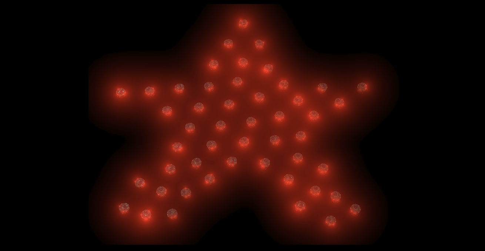

<h1 align="center">Distributed Robotics Project:   Adapting Shape Assembly of Robot Swarms</h1>

<h3 align="center">Matheus Latorre Cavini and Nikita Maurer</h3>

  

**This project was developed as part of the *Distributed Robotic Systems* practical course of summer term 2025 at TU Darmstadt. It re-implements and adapts a decentralized strategy for shape
assembly based on [[1](#reference)] using Pi-pucks.
The repository contains python code for real Pi-puck robots and simulation using Webots simulator.**

## Repo Structure

- **`io`** Directory for data exchange:
    - **`/shapes`**: contains `.png` image files for shapes to be assembled.
    - **`/plots`**: output directory for plots generated when evaluating.
    - **`/results`**: output directory for metric results generated when evaluating.
    - **`/_tex`**: contains internally managed floor textures for simulation.

- **`webots`** *Webots project* directory with fixed structure:
    - **`/controllers`** contains Pi-puck controller programs defining the entry point for e.g. shape assembly execution (sim and real!).
    - **`/worlds`** contains Webots `.wbt` world files.
- **`src`** Source code for shape assembly (and scripts).
- **`scripts`** Directory for scripts.

## Setup

#### 1. Install Webots simulator: https://cyberbotics.com/

#### 2. Create and activate a conda environment:

    conda create -n <env-name> python=3.9
    conda activate <env-name>

#### 3. Clone repository (e.g. via HTTPS):

    git clone https://github.com/mnikita/shape-assembly-public.git
    cd shape-assembly

#### 4. Install packages via requirements.txt:

    pip install -r requirements.txt

#### 5. Install _Mosquito_ Broker:
The simulation runs a MQTT server to broadcast robots infos. It requires the _Mosquito_ broker to be downloaded, following the installation instructions on their download page: https://mosquitto.org/download/

#### 6. Specify the path to the Python interpreter in Webots:
- Open Webots GUI and go to **Tools → Preferences**

- Under the **Python command** field, paste the full path to the python interpreter, e.g.:
  
      /home/<usr-name>/[anaconda3|miniconda3]/envs/<env-name>/bin/python

## Start

### Simulation
1. Check configs in `config_sim.yaml`, e.g., desired shape. (You can leave defaults for your first try.)
2. In Webots, open the simulation environment via **File → Open World** and select a suited`.wbt` world file in the `.../shape-assembly/webots/worlds/` directory, e.g. `swarm30.wbt`.
    - Note, by convention, the number in the world name, e.g. `swarm30.wbt`, indicates the maximum number of robots that exist in the world. Configuring a `swarm_size` > 30, would still run with 30 robots. However, configuring a `swarm_size` of, e.g. 25, would automatically remove surplus robots from the world until it is reloaded. Make sure not to save in this case to prevent overwrighting the world state.
3. Run the simulation by clicking the play button (or press **Ctrl + 2**)

### Real Robots
1. Turn on the pi-pucks, check configs and list their `ids` (e.g. 1, 5, 30) as strings in the `config_real.yaml` file.
    -  Also, make sure to add GitHub credentials in both `setup*.py` scripts. 
2. Use the parallel setup script from host to automatically connect via SSH, setup the Git repository and install relevant packages for all robots (e.g. 1, 5, 30):
    
        python3 setup_parallel.py 1 5 30 -p [-i]

    - Note, the subsequent (parallel) execution mode is not working, so you can type `n` each time when prompted.
    - After changing the code base or config on your host machine, run this command again **without** installation flag -i for an update (pull) without re-installation.

3. You can try to execute the controller for each robot from host either via 

        python3 setup.py <id> -e

    or manually via SSH connected termainal from each robot:

        python3 shape-assembly/webots/controllers/assemble_shape/assemble_shape.py
    
    This leaves the robots in a waiting state for two minutes.

3. From your host machine, run the shape publishing service to give the start signal:

        cd scripts
        python3 publish_real_shapes.py

    - Just press `Ctrl + C` to stop the program.

## Scripts

- **`shape_painter.py`** starts shape painter GUI for creating new shape images.
- **`publish_real_shape.py`** global shape publishing service for real robots.
- **`evaluate.py`** starts performance metric based evaluation.
- **`plot_metrics.py`** allows manual loading and plotting of existing metric results.
- **`graphic_sim.py`** starts plot based simulation of shape assembly.

## Developer Notes (Webots)

- Controller programs must be located in a folder with the same name so that they are recognized as such by Webots (e.g. `/webots/controllers/<program-name>/<program-name>.py`).
- To add Pi-pucks we recommend copying existing ones and incrementing their id following the naming convention below. If you do it manully follow the steps:
    - Click on the "+" symbol on the left side to "Add a node". 
    - Search for "E-puck" and select the Robot *PROTO* from gctronic.
    - To allow access to internal attributes, right click the added robot node and *"Convert to Base Nodes"*.
- Naming convention: Robots (E-pucks) created in Webots simulator are expected to have the name `ROB_<id>` where `<id>` is an integer without leading zero. This name should be entered in the `DEF` field and in the `name` field of the robots scene node.
- If you create a new world, make sure to assign the desired controller script to each of the robots in the scene:
    - Extend the robots scene tree node (via **>**) and click on the **controller "\<program\>"** field.
    - In the configuration window below click **Select...** and assign a controller program to the robot.
- Always make sure a *supervisor* robot exists in the world running the `mqtt_server` controller.
- For easier testing with variable swarm sizes, the `mqtt_server` controller removes robots from the world whose IDs are not specified under ***ids*** in the `config_sim.yaml`. After testing with reduced IDs, the world can be reloaded by clicking the`Reload World` icon (next to the saving icon) in the GUI. If the world was not saved in between and the original amount of robots is configured again, all robots will be back in the world.
- If you encounter warnings related to motor speed limits although the dispayed values are within the configured range, replaying or reloading the world should resolve them.
- Coordinate origin in webots simulation is the center point of the arena.
- The output "*WARNING: DEF ROB_<`id`> Robot: The remote control library has not been found*" can be ignored.

SSH connection command:

    ssh pi@pi-puck<id>

Installation commands for Pi-Puck API and MQTT package (for real Pi-pucks):

    git clone https://github.com/genkimiyauchi/pi-puck.git
    pip3 install pi-puck/python-library
    pip3 install VL53L1X
    pip3 install paho-mqtt

## Reference

[1] Sun, G., Zhou, R., Ma, Z. et al. Mean-shift exploration in shape assembly of robot swarms. Nat Commun 14, 3476 (2023). https://doi.org/10.1038/s41467-023-39251-5
